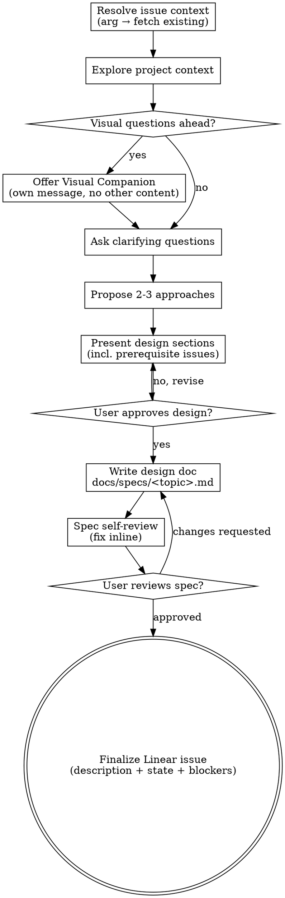

# Ralph Spec

Turn an idea into an Approved Linear issue that `/ralph-start` can dispatch. Same collaborative dialogue as `superpowers:brainstorming`, but the terminal state is a Linear issue in the ralph pipeline's `approved_state` — not a handoff to `writing-plans`.

Invocation:

```
/ralph-spec           # no existing ticket yet; create at the end
/ralph-spec ENG-220   # populate an existing ticket
```

<HARD-GATE>
The terminal state of this skill is the Approved Linear issue. Do NOT invoke any implementation skill, write any code, scaffold any project, or call `writing-plans`. Implementation happens later, in a different session, when `/ralph-start` dispatches the issue.
</HARD-GATE>

## Anti-Pattern: "This Is Too Simple To Need A Design"

Every ralph task goes through this process. A one-function utility, a config tweak, a label rename — all of them. Autonomous sessions have no human in the loop to catch unexamined assumptions. The spec can be short (a few sentences for truly simple work), but you MUST present it and get approval before writing it to the Linear description.

## Checklist

You MUST create a task for each of these items and complete them in order:

1. **Resolve issue context** — if called with an issue-id argument, set `ISSUE_ID=<arg>` and fetch its current description as starting context. Otherwise leave `ISSUE_ID` unset; it will be created in step 10.
2. **Explore project context** — check files, docs, recent commits. If `ISSUE_ID` is set, the existing description is part of this context.
3. **Offer visual companion** (if topic will involve visual questions) — its own message, no clarifying question alongside. See the Visual Companion section.
4. **Ask clarifying questions** — one at a time, understand purpose/constraints/success criteria.
5. **Propose 2-3 approaches** — with trade-offs and your recommendation.
6. **Present design** — in sections scaled to their complexity. Get user approval after each section. Explicitly surface any **prerequisite Linear issues** that must land before this one (for `blocked-by` relations in step 10).
7. **Write design doc** — save to `docs/specs/<topic>.md` and commit. If the file already exists, stop and ask the user before overwriting.
8. **Spec self-review** — quick inline check for placeholders, contradictions, ambiguity, scope (see below).
9. **User reviews written spec** — ask the user to review the spec file before Linear finalization.
10. **Finalize the Linear issue** — see "Finalizing the Linear Issue" below. Terminal state: issue description matches the approved spec, state is `approved_state`, blocked-by relations set.

## Process Flow



**The terminal state is the Approved Linear issue.** Do NOT invoke `writing-plans`, `subagent-driven-development`, or any other implementation skill. Implementation begins in a separate session via `/ralph-start`.

## The Process

**Understanding the idea:**

- If `ISSUE_ID` is set, start by reading its current description — that's the user's framing before the dialogue refines it.
- Check out the current project state (files, docs, recent commits).
- Before asking detailed questions, assess scope: if the request describes multiple independent subsystems (e.g., "build a platform with chat, file storage, billing, and analytics"), flag this immediately. Don't spend questions refining details of a project that needs to be decomposed first.
- If the project is too large for a single spec, help the user decompose into sub-projects: what are the independent pieces, how do they relate, what order should they be built? Each sub-project gets its own spec → its own ralph-spec invocation. Prerequisite relationships become `blocked-by` edges in step 10.
- For appropriately-scoped projects, ask questions one at a time. Prefer multiple choice; open-ended is fine too. One question per message.
- Focus on understanding: purpose, constraints, success criteria.

**Exploring approaches:**

- Propose 2-3 approaches with trade-offs and your recommendation.
- Lead with your recommended option and explain why.

**Presenting the design:**

- Scale each section to its complexity: a few sentences if straightforward, up to 200-300 words if nuanced.
- Ask after each section whether it looks right so far.
- Cover: architecture, components, data flow, error handling, testing.
- **Also cover prerequisites:** any Linear issues that must land before this one — in any project declared in the repo's `.ralph.json` scope. Cross-project blockers are fine as long as the prerequisite's project is in scope. These become `blocked-by` relations. Prerequisites outside the scope will trip `/ralph-start`'s out-of-scope blocker preflight; call that out now rather than letting it fail at dispatch.
- Be ready to go back and clarify if something doesn't make sense.

**Design for isolation and clarity:**

- Break the system into smaller units that each have one clear purpose, communicate through well-defined interfaces, and can be understood and tested independently.
- For each unit, you should be able to answer: what does it do, how do you use it, and what does it depend on?
- Can someone understand what a unit does without reading its internals? Can you change the internals without breaking consumers? If not, the boundaries need work.
- Smaller, well-bounded units are also easier for the autonomous implementer to work with — it reasons better about code it can hold in context at once.

**Working in existing codebases:**

- Explore the current structure before proposing changes. Follow existing patterns.
- Where existing code has problems that affect the work (a file that's grown too large, unclear boundaries, tangled responsibilities), include targeted improvements as part of the design — the way a good developer improves code they're working in.
- Don't propose unrelated refactoring. Stay focused on what serves the current goal.

## After the Design

**Documentation:**

- Write the validated design (spec) to `docs/specs/<topic>.md`.
  - Pick `<topic>` as a short kebab-case summary of what's being built.
  - If the file already exists, stop and ask before overwriting — it may belong to a related but distinct scope.
- Use `elements-of-style:writing-clearly-and-concisely` if available.
- Commit the design document to git.

**Spec self-review:**
After writing the spec, look at it with fresh eyes:

1. **Placeholder scan:** Any "TBD", "TODO", incomplete sections, or vague requirements? Fix them.
2. **Internal consistency:** Do any sections contradict each other? Does the architecture match the feature descriptions?
3. **Scope check:** Is this focused enough for a single autonomous implementation? If not, decompose into separate ralph-spec runs.
4. **Ambiguity check:** Could any requirement be interpreted two different ways? Pick one and make it explicit — the autonomous session has no one to ask.
5. **Autonomous-session readiness:** Does the spec give the autonomous implementer enough context to proceed without further human input? Requirements, interfaces, testing expectations, out-of-scope callouts — all explicit.

Fix any issues inline. No need to re-review — just fix and move on.

**User review gate:**
After the spec review, ask the user to review:

> "Spec written and committed to `docs/specs/<topic>.md`. Please review it and let me know if you want any changes before I finalize the Linear issue."

Wait for the user's response. If they request changes, make them and re-run the spec review. Only proceed to Linear finalization once the user approves.

## Finalizing the Linear Issue

Terminal step. Run substeps in order. Steps 1-2 are mandatory preflight gates — no mutation (comment, description, relation, state) happens until both pass. If any later step fails, STOP before the state transition.

**Shell note:** the snippets below share state across blocks (`RALPH_PROJECTS`, `STATE`, `PRIOR`, `ISSUE_ID`, `linear_get_issue_blockers`, …), so the whole finalization must run in a **single** shell session — not per-snippet `bash -c` calls, which spawn a fresh subshell each time and lose that state. Run them in one continuous session (any shell — `lib/config.sh` is portable between bash 3.2+ and zsh; per ENG-249).

### 1. Load ralph-start config and scope

```bash
CONFIG="${RALPH_CONFIG:-$HOME/.claude/skills/ralph-start/config.json}"

# Reuse ralph-start's own loaders so behavior doesn't drift.
# These exports become available after sourcing:
#   RALPH_APPROVED_STATE — the configured Approved state name
#   RALPH_PROJECTS       — newline-joined in-scope project names
#                          (config.sh expands initiative-shaped .ralph.json)
# And these helpers become callable:
#   linear_get_issue_blockers  — used in step 5 for blocker verification
source "$HOME/.claude/skills/ralph-start/scripts/lib/linear.sh" || {
  echo "ralph-spec: failed to source linear.sh — ralph-start skill may not be installed at \$HOME/.claude/skills/ralph-start/. Fix the install path or RALPH_CONFIG and re-run." >&2
  exit 1
}
source "$HOME/.claude/skills/ralph-start/scripts/lib/config.sh" "$CONFIG" || {
  echo "ralph-spec: failed to load ralph-start config/scope. Fix \$RALPH_CONFIG or \$(git rev-parse --show-toplevel)/.ralph.json and re-run." >&2
  exit 1
}
```

If either source command fails, stop — don't hand-roll `approved_state` parsing. The config is the source of truth and its validators are load-bearing (e.g. `.ralph.json` missing vs both-shapes-set vs initiative-zero-expansion).

### 2. Preflight the target issue (gate before any mutation)

If `ISSUE_ID` is set, fetch state, description, and project in one read, then branch before touching anything:

```bash
if [ -n "${ISSUE_ID:-}" ]; then
  VIEW=$(linear issue view "$ISSUE_ID" --json)
  STATE=$(echo "$VIEW" | jq -r '.state.name')
  PRIOR=$(echo "$VIEW" | jq -r '.description // empty')
  ISSUE_PROJECT=$(echo "$VIEW" | jq -r '.project.name // empty')
fi
```

Branch on `$STATE` before running anything below. Use the state names ralph-start's config loaded (`$RALPH_DONE_STATE`, `$RALPH_IN_PROGRESS_STATE`, `$RALPH_REVIEW_STATE`, `$RALPH_APPROVED_STATE`) rather than hard-coded strings — non-default workflow names would otherwise slip past the guards:

- **Equals `$RALPH_DONE_STATE` or `Canceled`**: stop and ask. Reopening a terminal state warrants explicit confirmation. (`Canceled` is the literal Linear state name — not in ralph-start's config because it's not a pipeline state.)
- **Equals `$RALPH_APPROVED_STATE`**: warn the user the prior spec will be overwritten. Require explicit confirmation before continuing.
- **Equals `$RALPH_IN_PROGRESS_STATE` or `$RALPH_REVIEW_STATE`**: stop and ask. Re-speccing an active issue usually means the operator is on the wrong ticket.
- **Anything else** (typically `Todo`, `Backlog`, or `Triage`): proceed.

Then validate `$ISSUE_PROJECT` against `$RALPH_PROJECTS`:

- **In `$RALPH_PROJECTS`**: proceed.
- **Not in `$RALPH_PROJECTS`**: stop. `/ralph-start` queries only in-scope projects to build its queue, so an Approved out-of-scope issue is *invisible* to the dispatcher — not flagged as an anomaly, just never picked up. Ask the user to either move the issue to an in-scope project first (`linear issue update "$ISSUE_ID" --project "<name>"`) or widen `.ralph.json`. Do not finalize until one of those lands.

Only after state and project checks both pass (and the user has confirmed any warnings) may you move on to step 3.

### 3. Resolve target project and ensure the issue exists

If `ISSUE_ID` is set, skip this step — step 2 already validated the issue's project against `$RALPH_PROJECTS` and stopped on mismatch, so if we're here the project is in scope.

If `ISSUE_ID` is unset, the new issue must land in a project listed in `$RALPH_PROJECTS` (already resolved by step 1, regardless of whether `.ralph.json` is `projects`- or `initiative`-shaped):

- **One project**: use it directly.
- **Multiple projects**: ask the user. Accept only an answer that appears in `$RALPH_PROJECTS` — reject anything else and re-ask.

Create via `linear-workflow`, honoring its duplicate-prevention flow, passing the validated project. Use the spec's title (verb-first imperative); leave description empty.

**After `linear-workflow` returns**, inspect what happened:

- **New issue created**: capture the new ID as `ISSUE_ID` and set `PRIOR=""` — a freshly-created issue has no prior content to preserve, and its state is the just-created default (typically `Todo`), project is the one we just passed.
- **Duplicate-prevention pointed at an existing issue**: capture that ID as `ISSUE_ID` and **loop back to step 2**. An existing issue reached through duplicate detection could be Done, Canceled, active, or in an out-of-scope project (if the duplicate lived outside `$RALPH_PROJECTS`); it also has a prior description that must be preserved. Re-running step 2 applies the same preflight gates as an explicit issue-id invocation would.

### 4. Preserve prior description as a comment

```bash
if [ -n "$PRIOR" ]; then
  TMP=$(mktemp)
  {
    printf '%s\n\n---\n\n' "**Original ask (pre-spec)** — preserved before \`/ralph-spec\` overwrote the description."
    printf '%s\n' "$PRIOR"
  } > "$TMP"
  linear issue comment add "$ISSUE_ID" --body-file "$TMP" || {
    echo "ralph-spec: failed to post preservation comment; aborting before description overwrite" >&2
    rm -f "$TMP"; exit 1;
  }
  rm -f "$TMP"
fi
```

`--body-file` (not `--body`) so markdown in the prior description round-trips correctly. Never overwrite the description before this comment lands — if the post fails, we must not lose the prior content.

### 5. Push spec, set blockers, verify (all-or-nothing before approval)

Blockers and description must all land cleanly before the state transition. A partial blocker set with the issue in `$RALPH_APPROVED_STATE` is materially unsafe — `/ralph-start` would dispatch the issue before the missing prerequisite completed.

**Before running anything in this step, explicitly initialize `PREREQS`** from the prerequisites identified during design. Bash treats an unset array as empty, so forgetting this line makes the relation-add loop a no-op AND makes the later verification trivially pass (empty `ACTUAL` matches empty `EXPECTED`) — the guard silently collapses. Declare the array explicitly, even when there are no prerequisites:

```bash
# No prerequisites identified during design:
PREREQS=()
# OR, prerequisites identified:
PREREQS=(ENG-180 ENG-185)
```

If the design surfaced prerequisites but the user hasn't supplied them explicitly to this step, STOP and ask — do not guess or default to empty. An Approved issue with missing blockers will be dispatched ahead of its dependencies.

```bash
linear issue update "$ISSUE_ID" --description-file docs/specs/<topic>.md || {
  echo "ralph-spec: description update failed; issue left in $STATE" >&2; exit 1;
}

# Cross-project blockers are fine as long as the blocker's project is in
# $RALPH_PROJECTS — out-of-scope blockers will trip ralph-start's preflight.
for p in "${PREREQS[@]}"; do
  linear issue relation add "$ISSUE_ID" blocked-by "$p" || {
    echo "ralph-spec: failed to add blocked-by $p; issue left in $STATE with partial blockers" >&2
    exit 1;
  }
done

# Verify the post-add blocker set matches what we asked for. Uses the same
# helper ralph-start's orchestrator uses, so the verification sees exactly
# what dispatch will see.
# Capture the helper's output and exit code separately — a naïve
# `helper | jq | sort` pipeline would take sort's exit code and silently
# produce an empty ACTUAL when the helper fails (auth/network/API error).
# With PREREQS also empty (no prerequisites case), that would falsely match
# and let the state transition proceed with unverified blockers.
BLOCKERS_JSON=$(linear_get_issue_blockers "$ISSUE_ID") || {
  echo "ralph-spec: linear_get_issue_blockers failed for $ISSUE_ID — cannot verify blocker set; issue left in $STATE" >&2
  exit 1
}
ACTUAL=$(printf '%s' "$BLOCKERS_JSON" | jq -r '.[].id' | sort -u)
EXPECTED=$(printf '%s\n' "${PREREQS[@]}" | sort -u)
if [ "$ACTUAL" != "$EXPECTED" ]; then
  echo "ralph-spec: blocked-by set mismatch on $ISSUE_ID" >&2
  echo "  expected: $(echo "$EXPECTED" | tr '\n' ' ')" >&2
  echo "  actual:   $(echo "$ACTUAL" | tr '\n' ' ')" >&2
  echo "Leaving issue in $STATE — investigate before re-running." >&2
  exit 1
fi
```

If any step above fails, STOP. Do **not** run the transition in step 6. Report which mutations landed and which didn't so the user can recover by hand.

### 6. Transition state

Only reached when steps 1-5 all succeeded.

```bash
linear issue update "$ISSUE_ID" --state "$RALPH_APPROVED_STATE" || {
  echo "ralph-spec: state transition to $RALPH_APPROVED_STATE failed for $ISSUE_ID." >&2
  echo "  Description and blocker relations already landed; issue is still in $STATE." >&2
  echo "  Retry the transition by hand: linear issue update $ISSUE_ID --state \"$RALPH_APPROVED_STATE\"" >&2
  exit 1
}
```

Only after the transition succeeds, tell the user:

> "`$ISSUE_ID` is now in `$RALPH_APPROVED_STATE`. Run `/ralph-start` at your next work session to dispatch it (along with any other Approved issues in the queue)."

If the transition failed, do NOT emit that message — the prior mutations landed but the issue is not dispatchable.

## Key Principles

- **One question at a time** — don't overwhelm with multiple questions.
- **Multiple choice preferred** — easier to answer than open-ended when possible.
- **YAGNI ruthlessly** — remove unnecessary features from all designs.
- **Explore alternatives** — always propose 2-3 approaches before settling.
- **Incremental validation** — present design, get approval before moving on.
- **Autonomous-session clarity** — the Linear description IS the PRD for an unattended implementer. Ambiguity costs more here than in a brainstorm for same-session work.

## Visual Companion

A browser-based companion for showing mockups, diagrams, and visual options during the dialogue. Available as a tool — not a mode. Accepting the companion means it's available for questions that benefit from visual treatment; it does NOT mean every question goes through the browser.

**Offering the companion:** When you anticipate that upcoming questions will involve visual content (mockups, layouts, diagrams), offer it once for consent:

> "Some of what we're working on might be easier to explain if I can show it to you in a web browser. I can put together mockups, diagrams, comparisons, and other visuals as we go. This feature is still new and can be token-intensive. Want to try it? (Requires opening a local URL)"

**This offer MUST be its own message.** Do not combine it with clarifying questions, context summaries, or any other content. Wait for the user's response before continuing. If they decline, proceed with text-only dialogue.

**Per-question decision:** Even after the user accepts, decide FOR EACH QUESTION whether to use the browser or the terminal. The test: **would the user understand this better by seeing it than reading it?**

- **Use the browser** for content that IS visual — mockups, wireframes, layout comparisons, architecture diagrams, side-by-side visual designs.
- **Use the terminal** for content that is text — requirements questions, conceptual choices, tradeoff lists, A/B/C/D text options, scope decisions.

A question about a UI topic is not automatically a visual question.

**Locating the companion:** The infrastructure lives in the superpowers plugin, not in this skill's directory. Resolve it at runtime via glob:

```bash
COMPANION_DIR=$(ls -d ~/.claude/plugins/cache/claude-plugins-official/superpowers/*/skills/brainstorming 2>/dev/null | sort -V | tail -1)
```

If `$COMPANION_DIR` is empty, the superpowers plugin isn't installed — proceed with text-only dialogue.

If set, read the detailed guide before invoking anything:

```bash
cat "$COMPANION_DIR/visual-companion.md"
```

Then use `$COMPANION_DIR/scripts/start-server.sh` and the other referenced scripts from that directory.
