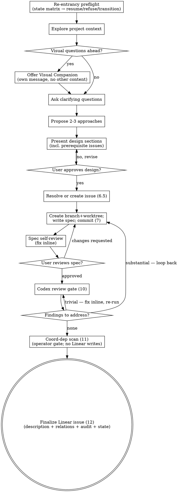

# Ralph Spec

Turn an idea into an Approved Linear issue that `/sr-start` can dispatch. Same collaborative dialogue as `superpowers:brainstorming`, but the terminal state is a Linear issue in the ralph pipeline's `approved_state` — not a handoff to `writing-plans`.

Under ENG-279's per-issue branch lifecycle, `/sr-spec` is the **primary creator** of an issue's branch and worktree. They are created once (lazily, at step 7 after design approval) and persist through `/sr-implement`, `/prepare-for-review`, and `/close-issue`'s merge ritual.

Invocation:

```
/sr-spec           # no existing ticket yet; create at step 6.5
/sr-spec ENG-220   # populate an existing ticket
```

<HARD-GATE>
The terminal state of this skill is the Approved Linear issue with its branch+worktree on disk and the spec committed on that branch. Do NOT invoke any implementation skill, write any code, scaffold any project, or call `writing-plans`. Implementation happens later, in a different session, when `/sr-start` dispatches the issue.
</HARD-GATE>

## Anti-Pattern: "This Is Too Simple To Need A Design"

Every ralph task goes through this process. A one-function utility, a config tweak, a label rename — all of them. Autonomous sessions have no human in the loop to catch unexamined assumptions. The spec can be short (a few sentences for truly simple work), but you MUST present it and get approval before writing it to the Linear description.

## Checklist

You MUST create a task for each of these items and complete them in order:

1. **Re-entrancy preflight** — if called with an issue-id argument, set `ISSUE_ID=<arg>` and run the state-and-residue matrix below to decide whether to refuse, transition, or resume. Otherwise leave `ISSUE_ID` unset; it will be created in step 6.5.
2. **Explore project context** — check files, docs, recent commits. If `ISSUE_ID` is set, the existing description and existing `blocked-by` relations are part of this context; soft-warn on any blockers whose specs aren't yet frozen.
3. **Offer visual companion** (if topic will involve visual questions) — its own message, no clarifying question alongside. See the Visual Companion section.
4. **Ask clarifying questions** — one at a time, understand purpose/constraints/success criteria.
5. **Propose 2-3 approaches** — with trade-offs and your recommendation.
6. **Present design** — in sections scaled to their complexity. Get user approval after each section. Explicitly surface any **prerequisite Linear issues** that must land before this one (for `blocked-by` relations in step 12).
7. **Resolve or create the Linear issue** (step 6.5) — if `ISSUE_ID` is unset, create the ticket now in a `$SENSIBLE_RALPH_PROJECTS` project; transition to `In Design`.
8. **Create branch+worktree, capture `SPEC_BASE_SHA`, write spec, commit** (step 7) — lazily create the per-issue branch+worktree (or `cd` into the existing pair on a re-spec), write `docs/specs/<topic>.md` on the branch, commit.
9. **Spec self-review** — quick inline check for placeholders, contradictions, ambiguity, scope (see below).
10. **User reviews written spec** — ask the user to review the spec file before the codex gate.
11. **Codex review gate** (step 10) — adversarial probing of the spec on the issue's own branch (`--base "$SPEC_BASE_SHA"`). Three finding buckets; loop back as needed.
12. **Coordination-dependency scan** (step 11) — operator-interaction-only. Run the scan helper, reason about file-level overlap with Approved peers, and stage `accepted_edges` to a transport file. NO Linear writes here; all mutations defer to step 12 (finalize). See "Step 11 — Coordination-dependency scan" below.
13. **Finalize the Linear issue** (step 12) — see "Finalizing the Linear Issue" below. Terminal state: issue description matches the approved spec, state is `approved_state`, blocked-by relations set (semantic PREREQS plus accepted coord-dep edges), audit comment posted, coord-dep label applied if any edges were added. The branch+worktree persist; `/sr-start` finds them at next dispatch.

## Process Flow



**The terminal state is the Approved Linear issue.** Do NOT invoke `writing-plans`, `subagent-driven-development`, or any other implementation skill. Implementation begins in a separate session via `/sr-start`.

## Step 1 — Re-entrancy preflight

State decision table (note `STATE` is the issue's pre-`/sr-spec` state):

| `STATE` | Branch+worktree existence | Action |
|---|---|---|
| `Todo` / `Backlog` / `Triage` | Should be neither | Transition → `In Design`. If branch and/or worktree exist anyway, refuse with the manual cleanup recipe (see "Cancellation cleanup" below). Track the original state for rollback at finalize sub-step 2. |
| `In Design` | May or may not exist (depends on whether prior session reached step 7) | Resume. No transition (already in target state). Step 7 detects existing state and `cd`s in. |
| `$CLAUDE_PLUGIN_OPTION_APPROVED_STATE` | Should exist | Warn user: "this is a re-spec; the prior approved spec on the branch will be appended to and the Linear description will be overwritten." Confirm before proceeding. Transition `Approved → In Design` (track for rollback). Step 7 detects existing branch+worktree and `cd`s in. |
| `$CLAUDE_PLUGIN_OPTION_IN_PROGRESS_STATE` / `$CLAUDE_PLUGIN_OPTION_REVIEW_STATE` | Branch likely has impl commits | Refuse: "Issue is in `<state>`; re-speccing on top of implementation commits is a manual unwind. Either revert implementation work first, or cancel this issue and file a new one." |
| `$CLAUDE_PLUGIN_OPTION_DONE_STATE` | Branch likely already merged | Refuse: "Issue is Done. Open a new issue for follow-up work." |
| `Canceled` | Branch may exist locally | Refuse: "Issue is Canceled. Either reopen via Linear UI before re-running, or file a new issue." |

Implementation:

```bash
source "$CLAUDE_PLUGIN_ROOT/lib/defaults.sh"
source "$CLAUDE_PLUGIN_ROOT/lib/linear.sh"
source "$CLAUDE_PLUGIN_ROOT/lib/scope.sh"
source "$CLAUDE_PLUGIN_ROOT/lib/worktree.sh"

if [ -n "${ISSUE_ID:-}" ]; then
  STATE=$(linear issue view "$ISSUE_ID" --json | jq -r '.state.name')
  branch=$(linear_get_issue_branch "$ISSUE_ID")
  path=$(worktree_path_for_issue "$branch")
  brwt=$(worktree_branch_state_for_issue "$branch" "$path")
  brwt_state="${brwt%%$'\t'*}"   # both_exist | neither | partial
  brwt_cause="${brwt#*$'\t'}"    # empty unless partial

  case "$STATE" in
    Todo|Backlog|Triage)
      if [ "$brwt_state" != "neither" ]; then
        echo "sr-spec: $ISSUE_ID residue check — branch '$branch' or worktree '$path' exists, but issue is in '$STATE' (expected fresh)." >&2
        echo "  This is stale state from a cancelled/interrupted prior session." >&2
        echo "  Manual cleanup:" >&2
        echo "    git worktree remove --force \"$path\" 2>/dev/null" >&2
        echo "    git branch -D \"$branch\" 2>/dev/null" >&2
        exit 1
      fi
      linear issue update "$ISSUE_ID" --state "$CLAUDE_PLUGIN_OPTION_DESIGN_STATE" \
        || echo "sr-spec: failed to transition $ISSUE_ID to '$CLAUDE_PLUGIN_OPTION_DESIGN_STATE'; continuing with dialogue" >&2
      # Track in conversation context: original state was $STATE; this invocation transitioned to In Design.
      ;;
    "$CLAUDE_PLUGIN_OPTION_DESIGN_STATE")
      # Resume. No transition. Step 7 will check $brwt_state and cd in if both_exist.
      ;;
    "$CLAUDE_PLUGIN_OPTION_APPROVED_STATE")
      echo "sr-spec: $ISSUE_ID is Approved. Re-spec will append to the existing branch and overwrite the Linear description on finalize." >&2
      echo "  Continue? (yes/no)" >&2
      # Wait for explicit user confirmation before proceeding.
      # On confirmation, transition Approved → In Design (track for rollback in finalize sub-step 2).
      ;;
    "$CLAUDE_PLUGIN_OPTION_IN_PROGRESS_STATE"|"$CLAUDE_PLUGIN_OPTION_REVIEW_STATE")
      echo "sr-spec: $ISSUE_ID is in '$STATE'; re-speccing on top of implementation work is out of scope." >&2
      echo "  Either revert implementation work first, or cancel this issue and file a new one." >&2
      exit 1
      ;;
    "$CLAUDE_PLUGIN_OPTION_DONE_STATE")
      echo "sr-spec: $ISSUE_ID is Done. Open a new issue for follow-up work." >&2
      exit 1
      ;;
    Canceled)
      echo "sr-spec: $ISSUE_ID is Canceled. Reopen via Linear UI before re-running, or file a new issue." >&2
      exit 1
      ;;
    *)
      echo "sr-spec: $ISSUE_ID has unexpected state '$STATE'." >&2
      exit 1
      ;;
  esac
fi
```

`Todo|Backlog|Triage` is hardcoded by name — those names are not configurable plugin options. A workspace that has renamed those idle states must account for this gap.

## The Process

**Understanding the idea:**

- If `ISSUE_ID` is set, start by reading its current description — that's the user's framing before the dialogue refines it. The transition (if any) was performed by the preflight in step 1.
- If `ISSUE_ID` is set, also fetch the issue's existing `blocked-by` relations via `linear_get_issue_blockers "$ISSUE_ID"` and check each blocker's current state (`linear issue view <ID> --json | jq -r '.state.name'`). **Soft-warn** on any blocker whose state is not one of `$CLAUDE_PLUGIN_OPTION_APPROVED_STATE`, `$CLAUDE_PLUGIN_OPTION_IN_PROGRESS_STATE`, `$CLAUDE_PLUGIN_OPTION_REVIEW_STATE`, or `$CLAUDE_PLUGIN_OPTION_DONE_STATE` — that parent's spec isn't frozen, so designing this child against it risks rework if the parent's surface shifts. List each un-frozen blocker (ID + current state) to the user and ask whether to proceed anyway or pause to spec the parent first. Advisory, not a gate; proceed if the user confirms. Without-arg invocations have no pre-existing blockers — skip this check.
- Check out the current project state (files, docs, recent commits).
- Before asking detailed questions, assess scope: if the request describes multiple independent subsystems (e.g., "build a platform with chat, file storage, billing, and analytics"), flag this immediately. Don't spend questions refining details of a project that needs to be decomposed first.
- If the project is too large for a single spec, help the user decompose into sub-projects: what are the independent pieces, how do they relate, what order should they be built? Each sub-project gets its own spec → its own sr-spec invocation. Prerequisite relationships become `blocked-by` edges in step 11.
- For appropriately-scoped projects, ask questions one at a time. Prefer multiple choice; open-ended is fine too. One question per message.
- Focus on understanding: purpose, constraints, success criteria.

**Exploring approaches:**

- Propose 2-3 approaches with trade-offs and your recommendation.
- Lead with your recommended option and explain why.

**Presenting the design:**

- Scale each section to its complexity: a few sentences if straightforward, up to 200-300 words if nuanced.
- Ask after each section whether it looks right so far.
- Cover: architecture, components, data flow, error handling, testing.
- **Also cover prerequisites:** any Linear issues that must land before this one — in any project declared in the repo's `.sensible-ralph.json` scope. Cross-project blockers are fine as long as the prerequisite's project is in scope. These become `blocked-by` relations. Prerequisites outside the scope will trip `/sr-start`'s out-of-scope blocker preflight; call that out now rather than letting it fail at dispatch.
- **Multi-parent prerequisite caveat.** If this spec ends up with 2+ `blocked-by` parents that won't have landed to `$SENSIBLE_RALPH_DEFAULT_BASE_BRANCH` before dispatch, the orchestrator will perform a multi-parent INTEGRATION merge of those parents into the worktree. We provide best-effort support — when parents conflict during integration, the dispatched session resolves the conflicts inline (see `docs/design/worktree-contract.md` "Pending parent merges"). But parent–parent conflicts are messy: a wrong resolution by the autonomous session can wedge the integration in subtle ways that only surface at review time. **Prefer to land prerequisites to trunk before filing the dependent issue.** If you can't avoid the pattern, weight the issue's complexity accordingly and expect more review-time iteration.
- Be ready to go back and clarify if something doesn't make sense.

**Design for isolation and clarity:**

- Break the system into smaller units that each have one clear purpose, communicate through well-defined interfaces, and can be understood and tested independently.
- For each unit, you should be able to answer: what does it do, how do you use it, and what does it depend on?
- Can someone understand what a unit does without reading its internals? Can you change the internals without breaking consumers? If not, the boundaries need work.
- Smaller, well-bounded units are also easier for the autonomous implementer to work with — it reasons better about code it can hold in context at once.

**Working in existing codebases:**

- Explore the current structure before proposing changes. Follow existing patterns.
- Where existing code has problems that affect the work (a file that's grown too large, unclear boundaries, tangled responsibilities), include targeted improvements as part of the design — the way a good developer improves code they're working in.
- Don't propose unrelated refactoring. Stay focused on what serves the current goal.

## Step 6.5 — Resolve or create the Linear issue

Insert between step 6 (design approval) and step 7 (branch+worktree). Two cases:

- **`ISSUE_ID` already set** (operator passed an arg): no-op. Issue already verified by the preflight in step 1.
- **`ISSUE_ID` unset**: run the issue-creation logic now. Specifically:
  1. Resolve `$TARGET_PROJECT` from `$SENSIBLE_RALPH_PROJECTS` — one-project case: use directly; multi-project case: ask the user to pick. Reject any answer not in `$SENSIBLE_RALPH_PROJECTS` and re-ask.
  2. Run the duplicate-prevention scan (`linear issue query --project "$TARGET_PROJECT" --search "<keyword>"`). Look for same feature described differently, issues that would be superseded, partially overlapping issues, or already-done work. Apply the rules in "Duplicate prevention" below.
  3. Create the Linear issue (`linear issue create --project "$TARGET_PROJECT" --title "<title>" --state "Todo"`).
  4. Capture `ISSUE_ID` and immediately transition to `$CLAUDE_PLUGIN_OPTION_DESIGN_STATE` (matches step 1's transition for the with-arg case).
  5. Track in conversation context: this invocation created the issue and transitioned it. Set `PRIOR=""` — a freshly-created issue has no prior content to preserve.

### Duplicate prevention

```bash
linear issue query --project "$TARGET_PROJECT" --search "<keyword or title phrase>" --json \
  | jq -r '.nodes[] | "\(.identifier)\t\(.state.name)\t\(.title)"'
```

- **Exact duplicate** — don't create. Surface to the user ("This appears to already be filed as `$EXISTING_ID`; want to populate that issue instead?"). If they confirm, capture `ISSUE_ID=$EXISTING_ID` and loop back to step 1's preflight so the state/project checks apply.
- **Superseded by this design** — surface to the user and propose canceling the old issue with a comment linking to the new one once created. Don't cancel without confirmation.
- **Partially overlapping** — surface to the user and let them decide whether to merge, split, or file alongside.
- **Already done but not marked Done** — surface to the user and propose closing it.

Issue-creation conventions:

- **Title**: verb-first imperative, scannable at a glance. No prefixes like `[FE]` or `Done when …`.
- **Project**: `$TARGET_PROJECT` (the validated in-scope project).
- **State**: `Todo` (sub-step 4 transitions to `$CLAUDE_PLUGIN_OPTION_DESIGN_STATE`).
- **No description**: step 11's finalization overwrites it with the approved spec.
- **No assignee, no priority flag, no labels** at creation. The user adjusts these post-finalize.

## Step 7 — Create branch+worktree, capture `SPEC_BASE_SHA`, write spec, commit

Resolve the branch and worktree paths, then either reuse (Approved re-spec or interrupted In Design with a prior step-7 commit) or create. `worktree_branch_state_for_issue` distinguishes the cases.

```bash
ISSUE_BRANCH=$(linear_get_issue_branch "$ISSUE_ID")
WORKTREE_PATH=$(worktree_path_for_issue "$ISSUE_BRANCH")

state=$(worktree_branch_state_for_issue "$ISSUE_BRANCH" "$WORKTREE_PATH")
state_name="${state%%$'\t'*}"

case "$state_name" in
  both_exist)
    # Re-run path. Branch+worktree from a prior /sr-spec session.
    # cd in. SPEC_BASE_SHA = current branch HEAD (= prior-spec HEAD).
    cd "$WORKTREE_PATH"
    SPEC_BASE_SHA=$(git rev-parse HEAD)
    ;;
  neither)
    # Fresh path. Create branch off default base, cd in.
    worktree_create_at_base "$WORKTREE_PATH" "$ISSUE_BRANCH" "$SENSIBLE_RALPH_DEFAULT_BASE_BRANCH" \
      || { echo "sr-spec: worktree create failed for $ISSUE_BRANCH" >&2; exit 1; }
    cd "$WORKTREE_PATH"
    SPEC_BASE_SHA=$(git rev-parse HEAD)
    ;;
  partial)
    echo "sr-spec: partial residue for $ISSUE_ID — ${state#*$'\t'} exists in isolation. Manual cleanup required:" >&2
    echo "    git worktree remove --force \"$WORKTREE_PATH\" 2>/dev/null" >&2
    echo "    git branch -D \"$ISSUE_BRANCH\" 2>/dev/null" >&2
    exit 1
    ;;
esac

# Write spec doc and commit. The doc is committed on the branch — NOT on
# main. It will arrive on main when /close-issue merges the branch.
TOPIC="<short kebab-case summary, picked from the approved design>"
SPEC_FILE="docs/specs/${TOPIC}.md"

if [ -e "$SPEC_FILE" ] && [ "$state_name" != "both_exist" ]; then
  # File-exists guard, only on first-time spec creation. On re-spec
  # (both_exist), the file IS expected to exist and will be overwritten.
  echo "sr-spec: $SPEC_FILE already exists. Stop and ask the operator." >&2
  exit 1
fi

# Write the approved spec content, then:
git add "$SPEC_FILE"
git commit -m "docs(spec): <verb-first imperative, e.g. 'add per-issue branch lifecycle spec'>

Ref: $ISSUE_ID"
```

`SPEC_BASE_SHA` is consumed by step 10 (codex gate) below; it lives only in the shell. **`.sensible-ralph-base-sha` is NOT written by `/sr-spec`** — the orchestrator writes it post-merge at dispatch time. See `docs/design/worktree-contract.md`.

## Spec self-review

After writing the spec, look at it with fresh eyes:

1. **Placeholder scan:** Any "TBD", "TODO", incomplete sections, or vague requirements? Fix them.
2. **Internal consistency:** Do any sections contradict each other? Does the architecture match the feature descriptions?
3. **Scope check:** Is this focused enough for a single autonomous implementation? If not, decompose into separate sr-spec runs.
4. **Ambiguity check:** Could any requirement be interpreted two different ways? Pick one and make it explicit — the autonomous session has no one to ask.
5. **Autonomous-session readiness:** Does the spec give the autonomous implementer enough context to proceed without further human input? Requirements, interfaces, testing expectations, out-of-scope callouts — all explicit.

Fix any issues inline. No need to re-review — just fix and move on. Iteration commits accumulate on the branch; `SPEC_BASE_SHA` stays the same.

## User review gate

After the spec self-review, ask the user to review:

> "Spec written and committed to `docs/specs/<topic>.md` on branch `$ISSUE_BRANCH`. Please review it and let me know if you want any changes before I run the codex gate."

Wait for the user's response. If they request changes, make them and re-run the spec self-review. Only proceed to step 10 once the user approves.

## Step 10 — Codex review gate

Adversarial probing of the approved spec. Last chance to catch mechanism-level defects before dispatch.

### Purpose

The autonomous implementer follows the spec literally with no human in the loop, so spec-time codex probing is the safety net for ambiguities and mechanism-level claims that don't survive scrutiny. Adversarial probing of user-approved decisions IS the value — no escape hatch exists for findings that contradict prior dialogue. Present findings to the user honestly; the user decides whether to revise or keep the original call. A decision that survives adversarial probing is stronger than one that was never tested.

### Detection (graceful degradation)

```bash
CODEX_SCRIPT=$(find ~/.claude/plugins -name 'codex-companion.mjs' -path '*/openai-codex/*/scripts/*' 2>/dev/null | head -1)
```

If empty, log this exact warning verbatim and proceed to step 11:

> codex-review-gate not installed — skipping codex spec review.
> Operators relying on this gate for autonomous-safety guarantees
> should install it.

If non-empty, continue.

### Run the gate (we are already on the branch, in the worktree)

```bash
node "$CODEX_SCRIPT" review --json --base "$SPEC_BASE_SHA" || {
  echo "sr-spec: standard codex review failed; gate aborted" >&2
  exit 1
}
node "$CODEX_SCRIPT" adversarial-review --json --base "$SPEC_BASE_SHA" "<focus text>" || {
  echo "sr-spec: adversarial codex review failed; gate aborted" >&2
  exit 1
}
```

`<focus text>` defaults to:

> Probe this design for: (1) ambiguities an autonomous implementer
> would misinterpret — places where two reasonable readings produce
> different code; (2) mechanism-level claims that don't hold under
> scrutiny — interfaces, return values, side effects, error contracts
> asserted by prose; (3) missing failure modes — what happens when
> the assumed inputs/state don't hold; (4) scope creep or hidden
> coupling — does this spec quietly reach into systems it shouldn't?

Override condition: if the spec has a salient targeted risk (concurrency, auth, data integrity, integration boundary), write per-spec focus text naming the mechanism and failure mode per `codex-review-gate`'s "Targeted-risk prompts" guidance. The default is a backstop, not a ceiling.

### Three finding buckets (caller policy)

1. **Trivially actionable** — clear defect, prose tightening, ambiguity fix that doesn't change a mechanism, contract, or scope boundary.
   *Action:* fix inline → commit (new commit, don't amend) → re-run the gate. `SPEC_BASE_SHA` stays the same; new commits accumulate on the branch and codex sees the cumulative diff.

2. **Substantial actionable** — mechanism redesign, missed failure mode, scope change, contract correction.
   *Action:* loop back to step 7 (rewrite the spec doc, new commit) → re-run self-review → re-ask user → re-run the gate. `SPEC_BASE_SHA` stays the same.

3. **User judgment / contradicts prior dialogue** — finding is ambiguous, requires a design call, or pushes back on a decision the user already made.
   *Action:* present to the user → user decides → apply as agreed (becomes bucket 1 or 2 in size). No escape hatch — adversarial probing of user-approved decisions IS the value.

### Skip criterion (re-runs only)

First-run on an issue: the gate **always** invokes codex.

Re-runs on an issue already in `$CLAUDE_PLUGIN_OPTION_APPROVED_STATE`: the gate **may** be skipped if the diff against the prior approved spec is purely cosmetic (typo, formatting, prose clarification with no change to acceptance criteria, mechanism, scope, or interface). The prior approved spec is the previous commit on the branch (or the common ancestor of branch and `$SENSIBLE_RALPH_DEFAULT_BASE_BRANCH` if the operator force-fetches a different reference); compute via `git diff <prior-approved> HEAD -- "$SPEC_FILE"`. When in doubt, run.

### Convergence

No max-iteration count. Trust user judgment. Genuinely-out-of-scope findings get filed as Linear follow-up issues, not crammed into this spec.

## Step 11 — Coordination-dependency scan

**Operator-interaction-only.** Does NOT write to Linear. Stages
`accepted_edges` to a transport file at
`<worktree>/.sensible-ralph-coord-dep.json` so step 12 (finalize) can
absorb the writes into its all-or-nothing-before-Approved sequence —
keeping the In-Design issue residue-free until finalize succeeds
atomically.

The scan runs **after** the codex gate by design. The scan typically
only adds blockers; it does not rewrite the spec, so running on
already-codex-cleared content avoids re-scanning after substantive
codex iterations.

The detection is reasoning-driven, not regex-based. The scan helper
assembles spec-level data; the structured-prompt below judges
collisions vs. colocation.

### Audit comment format

This is the canonical format. Both `/sr-spec` and ENG-281's
`/sr-start` backstop emit this exact shape; `/close-issue` step 8
parses ONLY the ```` ```coord-dep-audit ```` fenced JSON block — bullet
text is NOT delete authority. The single source of truth is
`skills/sr-spec/scripts/coord_dep_scan.sh`'s header comment.

```
**Coordination dependencies added by /sr-spec scan**

- blocked-by ENG-X — both restructure `lib/scope.sh`'s `_scope_load` function
- blocked-by ENG-Y — ENG-Y renames `foo.sh` which this spec edits inline

```coord-dep-audit
{"parents": ["ENG-X", "ENG-Y"]}
```

Will be removed automatically on `/close-issue`.
```

### Sub-step 1: Load any prior transport file

A prior `/sr-spec` may have added relations and aborted before
posting the audit comment. Loading (rather than clearing) lets the
operator re-audit those at sub-step 6 so step 12 can re-post the
audit comment.

```bash
COORD_DEP_FILE="$WORKTREE_PATH/.sensible-ralph-coord-dep.json"
if [[ -f "$COORD_DEP_FILE" ]]; then
  prior_accepted_edges=$(cat "$COORD_DEP_FILE")
else
  prior_accepted_edges='[]'
fi
```

### Sub-step 2: Label-existence preflight

`linear issue update --label` silently no-ops on unknown labels, so
step 12's `linear_add_label` would be a silent no-op without this
gate, hiding incomplete cleanups later. Refuse to proceed if missing.

```bash
if ! linear_label_exists "$CLAUDE_PLUGIN_OPTION_COORD_DEP_LABEL"; then
  echo "step 11: workspace label '$CLAUDE_PLUGIN_OPTION_COORD_DEP_LABEL' missing — create it or update plugin config" >&2
  # Operator can create the label and retry, or skip step 11 entirely
  # (proceed to step 12 with no coord-dep writes; ENG-281's /sr-start
  # backstop covers missed edges).
fi
```

### Sub-step 3: Run the scan helper

```bash
SCAN_BUNDLE=$(bash "$CLAUDE_PLUGIN_ROOT/skills/sr-spec/scripts/coord_dep_scan.sh" \
  "$SPEC_FILE" \
  "${PREREQS[@]+"${PREREQS[@]}"}")
```

The helper assembles a JSON bundle: `{ issue_id, new_spec, peers, existing_blockers }`. See
`skills/sr-spec/scripts/coord_dep_scan.sh` for the full contract.

### Sub-step 4: Trivial fast path

Only when `peers` is empty (or all overlaps map to parents already in
`existing_blockers`) **AND** `prior_accepted_edges` is empty: write
`[]` to the transport file (matches the format from sub-step 7), emit
`step 11: No coordination dependencies detected.`, and proceed to step
12. If `prior_accepted_edges` is non-empty, do **NOT** take the fast
path — fall through to the operator gate so prior entries get
re-audit consideration.

### Sub-step 5: Structured-prompt reasoning

Reason over the new spec body and each peer's title and description.
Six-item checklist:

1. List path-level surface for the new spec (files touched, restructured, renamed).
2. Same for each peer.
3. Report shared paths.
4. For each shared path, judge collide vs. disjoint; keep only collisions.
5. List identifier-level overlaps (function names, env vars, config keys).
6. List rename/move overlaps (one moves/renames a file the other edits).

Skip any peer whose ID already appears in `existing_blockers` (defensive
re-check; the helper already filtered).

### Sub-step 6: Per-candidate operator gate

Merge fresh-scan candidates with `prior_accepted_edges` (dedup by
parent ID; for parents in both, present with the more recent
rationale and note prior confirmation).

For each candidate show: parent ID + title, source (fresh-scan /
prior-accepted), category, one-line rationale. Three choices:
**accept / reject / edit-rationale**.

Rejecting a prior-accepted entry that's already in `INITIAL_BLOCKERS`
(captured at finalize sub-step 2) means the relation **stays in
Linear without an audit comment** — surface this consequence in the
rejection prompt so the operator can manually remove the relation
via Linear UI if they want.

### Sub-step 7: Persist `accepted_edges` to the transport file

Format is an array of `{parent, rationale}` objects:

```json
[{"parent": "ENG-X", "rationale": "..."}, ...]
```

**Always write the file** (empty array `[]` when nothing accepted) so
step 12 can distinguish "step 11 ran" (file exists) from "step 11
was bypassed" (file absent). Each Bash tool call in the skill is a
fresh process — the transport file is the only reliable
step-11→step-12 handoff.

The transport file is gitignored (`/.sensible-ralph-coord-dep.json`)
and per-worktree; successful finalize deletes it (sub-step 9 of step
12).

## Finalizing the Linear Issue (Step 12)

Terminal step. Run sub-steps in order. Sub-steps 1-2 are mandatory preflight gates — no mutation (comment, description, relation, state) happens until both pass. If any later sub-step fails, STOP before the state transition.

**Shell note:** the snippets below share state across blocks (`SENSIBLE_RALPH_PROJECTS`, `STATE`, `PRIOR`, `ISSUE_ID`, `linear_get_issue_blockers`, …), so the whole finalization must run in a **single** shell session — not per-snippet `bash -c` calls, which spawn a fresh subshell each time and lose that state. Run them in one continuous session (any shell — `lib/scope.sh` is portable between bash 3.2+ and zsh).

### 1. Confirm scope is loaded

The plugin libraries should already be sourced from step 1. If somehow they aren't, source them now:

```bash
source "$CLAUDE_PLUGIN_ROOT/lib/defaults.sh"
source "$CLAUDE_PLUGIN_ROOT/lib/linear.sh" || {
  echo "sr-spec: failed to source linear.sh — \$CLAUDE_PLUGIN_ROOT may be unset (sensible-ralph plugin not enabled?). Re-enable the plugin and re-run." >&2
  exit 1
}
source "$CLAUDE_PLUGIN_ROOT/lib/scope.sh" || {
  echo "sr-spec: failed to load scope. Fix \$(git rev-parse --show-toplevel)/.sensible-ralph.json and re-run." >&2
  exit 1
}
```

### 2. Preflight the target issue (gate before any mutation)

`ISSUE_ID` is set by step 1 (with-arg) or step 6.5 (created here). Re-fetch state, description, and project once for the final preflight:

```bash
VIEW=$(linear issue view "$ISSUE_ID" --json)
STATE=$(printf '%s' "$VIEW" | jq -r '.state.name')
PRIOR=$(printf '%s' "$VIEW" | jq -r '.description // empty')
ISSUE_PROJECT=$(printf '%s' "$VIEW" | jq -r '.project.name // empty')
```

Branch on `$STATE` before running anything below. Use the state names the plugin harness exported (`$CLAUDE_PLUGIN_OPTION_DONE_STATE`, `$CLAUDE_PLUGIN_OPTION_IN_PROGRESS_STATE`, `$CLAUDE_PLUGIN_OPTION_REVIEW_STATE`, `$CLAUDE_PLUGIN_OPTION_APPROVED_STATE`) rather than hard-coded strings:

- **Equals `$CLAUDE_PLUGIN_OPTION_DONE_STATE` or `Canceled`**: stop and ask. Reopening a terminal state warrants explicit confirmation.
- **Equals `$CLAUDE_PLUGIN_OPTION_APPROVED_STATE`**: should not normally occur — step 1 transitioned an Approved re-spec to In Design after explicit confirmation. If somehow we're here on a re-spec without the transition, stop and ask.
- **Equals `$CLAUDE_PLUGIN_OPTION_IN_PROGRESS_STATE` or `$CLAUDE_PLUGIN_OPTION_REVIEW_STATE`**: stop and ask. Re-speccing an active issue usually means the operator is on the wrong ticket.
- **Anything else** (typically `$CLAUDE_PLUGIN_OPTION_DESIGN_STATE` — the common path after step 1): proceed.

Then validate `$ISSUE_PROJECT` against `$SENSIBLE_RALPH_PROJECTS`:

- **In `$SENSIBLE_RALPH_PROJECTS`**: proceed.
- **Not in `$SENSIBLE_RALPH_PROJECTS`**: stop. `/sr-start` queries only in-scope projects to build its queue, so an Approved out-of-scope issue is *invisible* to the dispatcher — not flagged as an anomaly, just never picked up. If you noted in step 1 that this invocation successfully transitioned the issue to `In Design` from an idle state, check the issue's current state before rolling back (the operator may have manually moved it during the dialogue — don't overwrite that): if the current state is still `$CLAUDE_PLUGIN_OPTION_DESIGN_STATE`, issue `linear issue update "$ISSUE_ID" --state "<original-state>"`. If the rollback command fails, tell the user explicitly: "Warning: failed to restore `$ISSUE_ID` to `<original-state>`; it is currently in `In Design`. Move it back manually." Then ask the user to either move the issue to an in-scope project first or widen `.sensible-ralph.json`. Do not finalize until one of those lands.

Only after state and project checks both pass (and the user has confirmed any warnings) may you move on to sub-step 3.

### 3. Resolve target project (no-op)

Step 6.5 already created the issue (when needed) in a `$SENSIBLE_RALPH_PROJECTS` project, and sub-step 2 above re-validated. Nothing to do here.

### 4. Preserve prior description as a comment

```bash
if [ -n "$PRIOR" ]; then
  TMP=$(mktemp)
  {
    printf '%s\n\n---\n\n' "**Original ask (pre-spec)** — preserved before \`/sr-spec\` overwrote the description."
    printf '%s\n' "$PRIOR"
  } > "$TMP"
  linear issue comment add "$ISSUE_ID" --body-file "$TMP" || {
    echo "sr-spec: failed to post preservation comment; aborting before description overwrite" >&2
    rm -f "$TMP"; exit 1;
  }
  rm -f "$TMP"
fi
```

`--body-file` (not `--body`) so markdown in the prior description round-trips correctly. Never overwrite the description before this comment lands.

### 5. Push spec, set blockers, post audit, verify (all-or-nothing before approval)

Blockers, description, and audit comment must all land cleanly before the state transition. A partial blocker set with the issue in `$CLAUDE_PLUGIN_OPTION_APPROVED_STATE` is materially unsafe — `/sr-start` would dispatch the issue before the missing prerequisite completed.

**Before running anything in this sub-step, explicitly initialize `PREREQS`** from the prerequisites identified during design:

```bash
# No prerequisites identified during design:
PREREQS=()
# OR, prerequisites identified:
PREREQS=(ENG-180 ENG-185)
```

If the design surfaced prerequisites but the user hasn't supplied them explicitly, STOP and ask — do not guess or default to empty.

The internal sequence absorbs the step-11 coord-dep writes:

#### 5.1. Read `accepted_edges` from the transport file

```bash
COORD_DEP_FILE="$WORKTREE_PATH/.sensible-ralph-coord-dep.json"
accepted_parents=()
if [[ -f "$COORD_DEP_FILE" ]]; then
  # Validate file shape BEFORE consuming. A truncated /
  # hand-edited / corrupted file must abort finalize, not
  # silently approve the issue with no coord-dep audit.
  #
  # Shape contract: a JSON array of objects, each having a
  # 'parent' key. Empty array `[]` is valid (the trivial
  # fast-path case in step 11 sub-step 4 writes exactly this).
  if ! jq -e 'type == "array" and all(.[]; type == "object" and has("parent"))' \
         "$COORD_DEP_FILE" >/dev/null 2>&1; then
    echo "step 12: $COORD_DEP_FILE is malformed (expected JSON array of {parent: ..., rationale: ...} entries) — aborting finalize." >&2
    echo "  Inspect or delete the file by hand before re-running /sr-spec." >&2
    exit 1
  fi
  # Extract parent IDs. Empty output for an empty array is
  # expected and fine — accepted_parents stays empty.
  parsed_parents=$(jq -r '.[].parent' "$COORD_DEP_FILE")
  while IFS= read -r p; do
    [[ -n "$p" ]] && accepted_parents+=("$p")
  done <<< "$parsed_parents"
fi
# If $COORD_DEP_FILE was absent, accepted_parents stays empty —
# that's the "no step-11 dialogue ran" or "operator skipped the
# scan" case, which is fine; finalize proceeds without coord-dep
# writes.
```

#### 5.2. Capture `INITIAL_BLOCKERS`

Needed in `EXPECTED` (sub-step 5.7) so re-spec's prior-session blockers are accepted as expected, not flagged as drift.

```bash
INITIAL_BLOCKERS=$(linear_get_issue_blockers "$ISSUE_ID" | jq -r '.[].id' | sort -u)
```

#### 5.3. Push spec description

```bash
linear issue update "$ISSUE_ID" --description-file docs/specs/<topic>.md || {
  echo "sr-spec: description update failed; issue left in $STATE" >&2; exit 1;
}
```

#### 5.4. Compute `ADD_LIST`, walk it (relations BEFORE comment)

```bash
ADD_LIST=$(printf '%s\n' \
  "${PREREQS[@]+"${PREREQS[@]}"}" \
  "${accepted_parents[@]+"${accepted_parents[@]}"}" \
  | sort -u | comm -23 - <(printf '%s\n' "$INITIAL_BLOCKERS"))

committed_parents=()
for parent in $ADD_LIST; do
  if linear issue relation add "$ISSUE_ID" blocked-by "$parent"; then
    committed_parents+=("$parent")
  else
    # Per-edge failure: surface to operator with three choices —
    #
    #   retry            : re-attempt the same parent.
    #   skip-this-edge   : ONLY for parents from accepted_parents
    #                      (coord-dep). Removes the parent from
    #                      accepted_parents so the audit comment
    #                      won't list it. NOT offered for PREREQS
    #                      parents — silently dropping a semantic
    #                      prereq would let an issue reach Approved
    #                      without its required dependency edge,
    #                      breaking /sr-start's pickup rule.
    #                      PREREQS failures get retry-or-abort only.
    #   abort finalize   : stop the loop. Audit comment has NOT
    #                      been posted yet, so any added relations
    #                      have NO audit trail — surface a recovery
    #                      recipe per sub-step 5.6's failure path.
    :
  fi
done
```

`comm -23` filters out anything already in `INITIAL_BLOCKERS` to avoid duplicate-add (Linear's CLI behavior on duplicates is unreliable across versions).

Comment-LAST is deliberate: it eliminates the over-claim failure mode where a skipped edge's marker line would later become destructive delete authority during cleanup. The trade-off (comment-post failure leaves relations without an audit trail) is handled in sub-step 5.6.

#### 5.5. End-of-loop invariant (when not aborted)

Every parent in `accepted_parents` is now in Linear — either pre-existing in `INITIAL_BLOCKERS` (operator re-confirmed prior) or in `committed_parents` (just added). Skipped parents have been removed from `accepted_parents`.

If `accepted_parents` is empty after the loop: skip sub-steps 5.6 and 5.7; fall through to verify (5.8).

#### 5.6. Post the audit comment (only if `accepted_parents` is non-empty)

Compose per "Audit comment format" in step 11 above. Bullet lines list every parent in `accepted_parents`; the ```` ```coord-dep-audit ```` block lists the same parent IDs. The audit set is `accepted_parents` in full — both newly-added and prior-already-in-Linear — because cleanup needs to discover ALL of them.

```bash
linear issue comment add "$ISSUE_ID" --body-file <tmp>
```

**On comment-post failure:** newly-added relations are in Linear without an audit trail. Operator chooses:

* **retry** — usually transient.
* **proceed-anyway** — print the comment body inline; operator manually posts via Linear UI. Do NOT transition state. Issue stays `In Design`; transport file intact for next-run reload.
* **rollback** — best-effort `linear issue relation delete` on each entry in `committed_parents` (this run's adds only; pre-existing prior-run relations are NOT touched). Issue stays `In Design`.

#### 5.7. Add the coord-dep label (only if `accepted_parents` is non-empty)

```bash
linear_add_label "$ISSUE_ID" "$CLAUDE_PLUGIN_OPTION_COORD_DEP_LABEL"
```

Idempotent. On failure: log; continue. The audit comment is the load-bearing artifact for cleanup, not the label.

#### 5.8. Verify

`EXPECTED == ACTUAL` over the union of (`INITIAL_BLOCKERS` ∪ `PREREQS` ∪ `accepted_parents`):

```bash
EXPECTED=$(printf '%s\n' \
  "${INITIAL_BLOCKERS[@]+"${INITIAL_BLOCKERS[@]}"}" \
  "${PREREQS[@]+"${PREREQS[@]}"}" \
  "${accepted_parents[@]+"${accepted_parents[@]}"}" \
  | sort -u)
ACTUAL=$(linear_get_issue_blockers "$ISSUE_ID" | jq -r '.[].id' | sort -u)
if [ "$ACTUAL" != "$EXPECTED" ]; then
  echo "sr-spec: blocked-by set mismatch on $ISSUE_ID" >&2
  echo "  expected: $(echo "$EXPECTED" | tr '\n' ' ')" >&2
  echo "  actual:   $(echo "$ACTUAL" | tr '\n' ' ')" >&2
  echo "Leaving issue in $STATE — investigate before re-running." >&2
  exit 1
fi
```

`accepted_parents` is the right set per sub-step 5.5's invariant — every entry is either in `INITIAL_BLOCKERS` or `committed_parents`.

If any sub-step 5.x above fails, STOP. Do **not** run the transition in sub-step 6.

The `${arr[@]+"${arr[@]}"}` guard above expands to nothing on empty arrays, avoiding bash 3.2's unbound-variable fault under `set -u`.

### 6. Transition state

Only reached when sub-steps 1-5 all succeeded.

```bash
linear issue update "$ISSUE_ID" --state "$CLAUDE_PLUGIN_OPTION_APPROVED_STATE" || {
  echo "sr-spec: state transition to $CLAUDE_PLUGIN_OPTION_APPROVED_STATE failed for $ISSUE_ID." >&2
  echo "  Description and blocker relations already landed; issue is still in $STATE." >&2
  echo "  Retry the transition by hand: linear issue update $ISSUE_ID --state \"$CLAUDE_PLUGIN_OPTION_APPROVED_STATE\"" >&2
  exit 1
}
```

### 7. Delete the transport file

Only after the state transition succeeds:

```bash
rm -f "$COORD_DEP_FILE"
```

If finalize fails before this point, the transport file persists for resume on the next `/sr-spec` run.

The branch and worktree persist after finalize. They are NOT torn down. `/sr-start` will find them at next dispatch.

Only after the transition succeeds, tell the user:

> "`$ISSUE_ID` is now in `$CLAUDE_PLUGIN_OPTION_APPROVED_STATE`. The branch+worktree at `$WORKTREE_PATH` is ready. Run `/sr-start` at your next work session to dispatch it (along with any other Approved issues in the queue)."

If the transition failed, do NOT emit that message — the prior mutations landed but the issue is not dispatchable.

## Cancellation cleanup

With lazy step-7 creation, residue only exists if the operator advances past step 7 (commits a spec doc) and then abandons or cancels the issue. Manual recipe:

```bash
# Operator manually cancels the issue in Linear, then:
git worktree remove --force "<repo>/.worktrees/<branch>" 2>/dev/null
git branch -D "<branch>" 2>/dev/null
```

A standalone `/sr-cleanup` skill is **out of scope** until pain is observed.

## Key Principles

- **One question at a time** — don't overwhelm with multiple questions.
- **Multiple choice preferred** — easier to answer than open-ended when possible.
- **YAGNI ruthlessly** — remove unnecessary features from all designs.
- **Explore alternatives** — always propose 2-3 approaches before settling.
- **Incremental validation** — present design, get approval before moving on.
- **Autonomous-session clarity** — the Linear description IS the PRD for an unattended implementer. Ambiguity costs more here than in a brainstorm for same-session work.
- **The branch is the workspace** — once step 7 commits the spec, all subsequent work (codex iteration, implementation, prepare-for-review, merge) lives on that branch.

## Visual Companion

A browser-based companion for showing mockups, diagrams, and visual options during the dialogue. Available as a tool — not a mode. Accepting the companion means it's available for questions that benefit from visual treatment; it does NOT mean every question goes through the browser.

**Offering the companion:** When you anticipate that upcoming questions will involve visual content (mockups, layouts, diagrams), offer it once for consent:

> "Some of what we're working on might be easier to explain if I can show it to you in a web browser. I can put together mockups, diagrams, comparisons, and other visuals as we go. This feature is still new and can be token-intensive. Want to try it? (Requires opening a local URL)"

**This offer MUST be its own message.** Do not combine it with clarifying questions, context summaries, or any other content. Wait for the user's response before continuing. If they decline, proceed with text-only dialogue.

**Per-question decision:** Even after the user accepts, decide FOR EACH QUESTION whether to use the browser or the terminal. The test: **would the user understand this better by seeing it than reading it?**

- **Use the browser** for content that IS visual — mockups, wireframes, layout comparisons, architecture diagrams, side-by-side visual designs.
- **Use the terminal** for content that is text — requirements questions, conceptual choices, tradeoff lists, A/B/C/D text options, scope decisions.

A question about a UI topic is not automatically a visual question.

**Locating the companion:** The infrastructure lives in the superpowers plugin, not in this skill's directory. Resolve it at runtime via glob:

```bash
COMPANION_DIR=$(ls -d ~/.claude/plugins/cache/claude-plugins-official/superpowers/*/skills/brainstorming 2>/dev/null | sort -V | tail -1)
```

If `$COMPANION_DIR` is empty, the superpowers plugin isn't installed — proceed with text-only dialogue.

If set, read the detailed guide before invoking anything:

```bash
cat "$COMPANION_DIR/visual-companion.md"
```

Then use `$COMPANION_DIR/scripts/start-server.sh` and the other referenced scripts from that directory.

## Red flags / when to stop

Stop the session WITHOUT finalizing the issue if:

- Step 1 preflight refuses (terminal state, conflicting impl work).
- The user can't approve the design and the dialogue isn't converging.
- The codex gate finds substantial issues that resist resolution after multiple iterations.
- Branch/worktree creation fails and the partial-residue cleanup recipe doesn't resolve it.
- The Linear CLI is unreachable for description/state/relation writes.

Cleanup recipe for an abandoned step-7 commit lives in "Cancellation cleanup" above.
